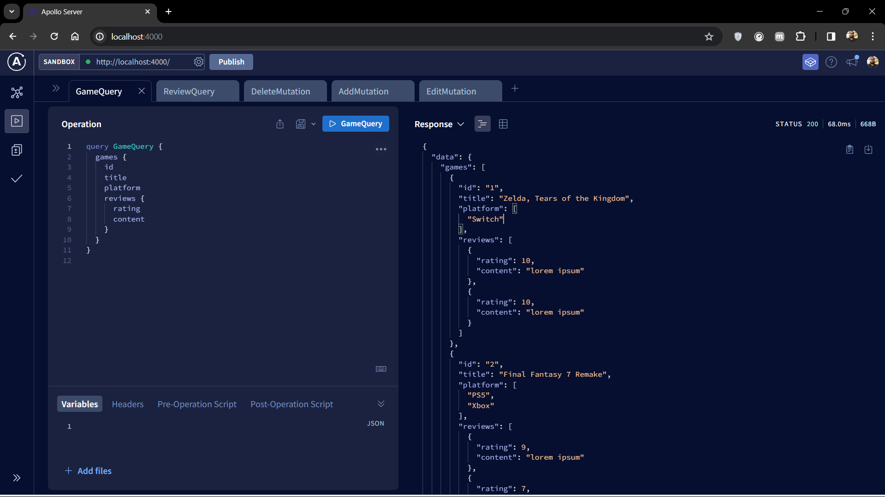

# graphql-playground
Just a playground to learn and practice with Graphql

[](https://standardjs.com)

### Stack
1. [Node.js v20](https://nodejs.org/dist/latest-v20.x/docs/api/)
2. [Graphql v16](https://graphql.org/)
3. [Apollo Server v4](https://www.apollographql.com/docs/apollo-server)

### Environment Variables
```bash
APP_PORT=4000 # default 3000
```

### Run Application
```bash
npm start 
```

